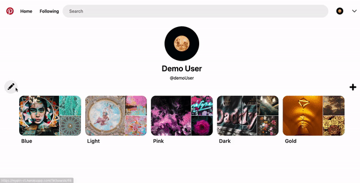
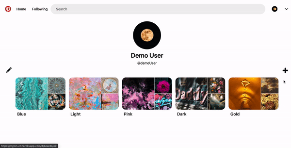

# [Pinterplay](https://mypin-ct.herokuapp.com/#/)

##

[Pinterplay](https://mypin-ct.herokuapp.com/#/) is a visual discovery engine for finding ideas like recipes, home and style inspiration, and more. With many Pins on Pinterplay, you'll always find ideas to spark inspiration. When you discover Pins you love, save them to boards to keep your ideas organized and easy to find!

## Technologies
- Ruby on Rails
- Javascript
- React
- Redux
- HTML
- CSS
- Postgres
- AWS photo storage

## Features

### Full User Authorization
- User authentication with persistence

### Profile
- Users may create and update custom profiles with their name, username, description and profile photo. 

### Boards
- Users may maintain profiles by creating, updating and deleting any number of custom boards. 

### Pins
- Boards are personalized with pins uploaded by the user or another user's pins chosen via the user's discover feed.
- Users may view, edit, and delete pins associated with a particular board.
- Users may view all the pins associated with their profiles.

   
## Future Direction

### Follows
- Ablility to follow and unfolow other users' profiles and boards
- Ability to search for pins by title
 
...
# Pinterplay
